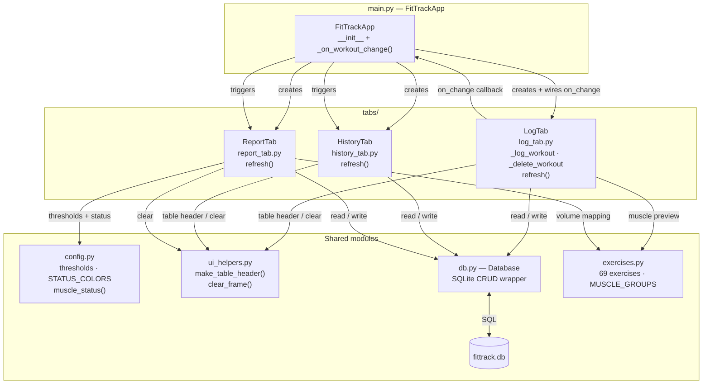
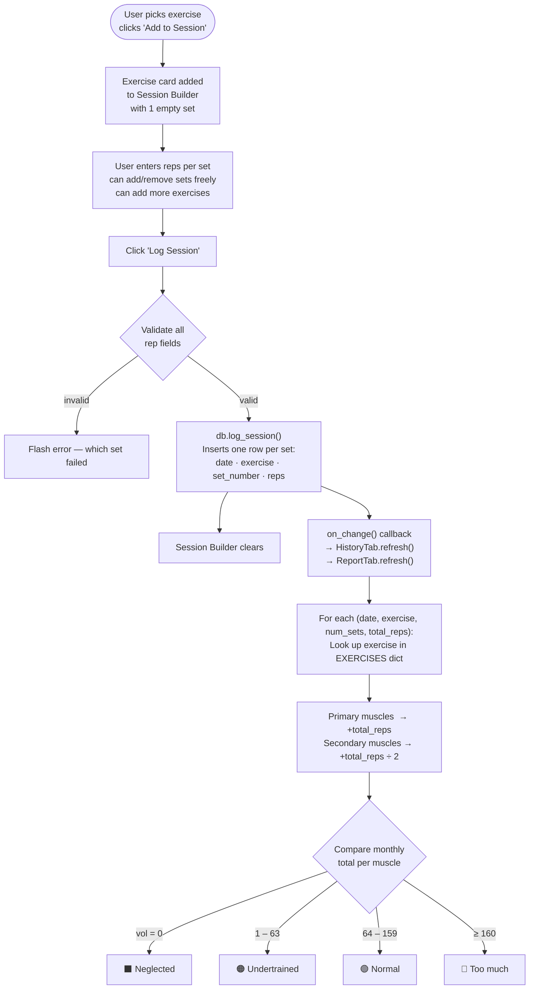
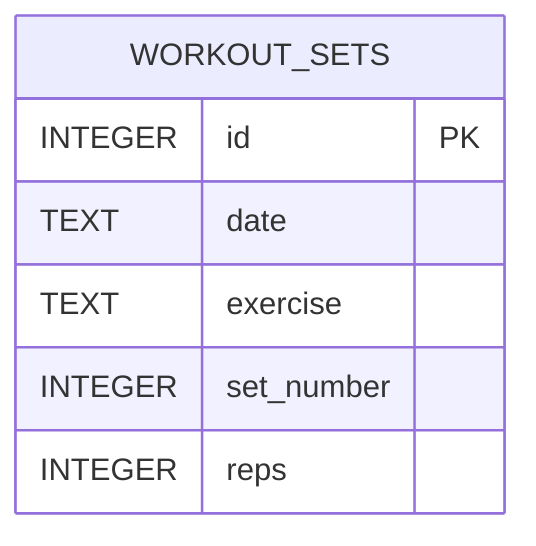

# FitTrack

A Python desktop app for logging workouts, tracking volume per muscle group, and getting monthly training balance feedback.

---

## Architecture



---

## Workout Logging Flow



---

## Volume Threshold Logic

Thresholds are derived from a target training profile:

| Parameter | Value |
|---|---|
| Working sets per muscle per session | 2 |
| Sessions per muscle per week | 2 (PPL / upper-lower / Arnold split) |
| Weeks per month | 4 |
| Target rep range | 5 – 8 |
| Lower rep limit | 4 |
| Upper rep limit | 10 |

**Formula:** `sets × rep_limit × sessions/week × weeks/month`

| Threshold | Calculation | Result |
|---|---|---|
| Normal floor | 2 × 4 × 2 × 4 | **64 / month** |
| Too much ceiling | 2 × 10 × 2 × 4 | **160 / month** |

| Monthly volume | Status |
|---|---|
| 0 | Neglected |
| 1 – 63 | Undertrained |
| 64 – 159 | Normal |
| ≥ 160 | Too much |

> **Important:** Only log **working sets**. Warm-up sets should not be counted — the thresholds assume true working-set volume only.

---

## Database Schema



Each individual set is its own row. Volume for an exercise = `SUM(reps)` across all its sets. History and report queries use `GROUP BY date, exercise` to aggregate.

---

## File Reference

| File | Purpose |
|---|---|
| [main.py](main.py) | App shell — `FitTrackApp`, tab wiring, `_on_workout_change` callback |
| [config.py](config.py) | Volume thresholds, `STATUS_COLORS`, `muscle_status()` |
| [ui_helpers.py](ui_helpers.py) | Shared UI utilities: `make_table_header`, `clear_frame` |
| [db.py](db.py) | `Database` class — SQLite CRUD wrapper |
| [exercises.py](exercises.py) | `EXERCISES` dict (69 exercises → primary/secondary muscles), `MUSCLE_GROUPS` list |
| [tabs/log_tab.py](tabs/log_tab.py) | `LogTab` — exercise picker, sets/reps form, today's log |
| [tabs/history_tab.py](tabs/history_tab.py) | `HistoryTab` — filterable workout history |
| [tabs/report_tab.py](tabs/report_tab.py) | `ReportTab` — monthly muscle volume bars + recommendations |
| [requirements.txt](requirements.txt) | `customtkinter>=5.2.0` |
| `fittrack.db` | Auto-created on first run, lives next to the scripts |

---

## Key Constants (config.py)

| Constant | Value | Meaning |
|---|---|---|
| `THRESHOLD_NORMAL` | `64` | Minimum monthly volume to be classified "Normal" |
| `THRESHOLD_TOO_MUCH` | `160` | Monthly volume at which a muscle is "Too much" |

To adjust the thresholds, edit [config.py](config.py).

---

## How to Run

```bash
pip install customtkinter
python main.py
```

---

## File Explanations

### `config.py`
The simplest file — just rules and colors. Defines two numbers: `THRESHOLD_NORMAL = 64` (minimum monthly reps to be considered "Normal") and `THRESHOLD_TOO_MUCH = 160` (the point where you're overtraining). Also holds `STATUS_COLORS`, a dictionary mapping each training status to a hex color code. The one function, `muscle_status`, takes a number and returns the right label by checking which range it falls into.

### `exercises.py`
A lookup book. `EXERCISES` is a dictionary where every key is an exercise name and every value is another dictionary with two lists: `primary` (muscles doing most of the work) and `secondary` (muscles that assist). Nothing runs here — it's pure data. `MUSCLE_GROUPS` at the bottom is an ordered list of the 12 muscle groups the app tracks.

### `ui_helpers.py`
Two reusable drawing functions shared by multiple tabs.

`make_table_header` draws the grey bar with column titles at the top of any list. You pass it a parent widget and a list of `(column name, width)` pairs and it draws a label for each one.

`clear_frame` loops through every widget inside a frame and destroys it. Called before any list redraws itself — wipe the slate clean, then draw fresh.

### `db.py`
The only file that talks to the database. Opens (or creates) `fittrack.db` using Python's built-in `sqlite3`. Every logged set gets its own row in `workout_sets` with four columns: date, exercise name, set number, and reps.

Write methods: `log_session` (inserts one row per set) and `delete_exercise_sets` (wipes every set for one exercise on one date).

Read methods: `get_today_summary` (groups today's sets into one row per exercise, summing reps), `get_workouts_range` (same grouping between two dates), `get_all_workouts` (same with no date filter).

### `main.py`
The entry point. `FitTrackApp` creates one `Database` instance shared by all three tabs, builds the tab bar, and passes `_on_workout_change` as a callback into `LogTab`. That callback keeps the other tabs in sync — whenever LogTab saves or deletes something, it calls this function, which tells History and Report to refresh.

### `tabs/log_tab.py`
The most complex file. Split into four sections:

**Layout (`_build`)** — runs once at startup. Creates the left panel (exercise picker: listbox, search box, muscle preview, "Add to Session" button) and the right panel (session builder scroll area, "Log Session" button, and the "Logged Today" strip at the bottom).

**Exercise picker** — `_filter_exercises` fires on every keystroke and repopulates the listbox with matching names. `_on_exercise_select` fires when you click a name. `_update_muscle_preview` looks up the selected exercise in `EXERCISES` and updates the yellow label showing which muscles it works.

**Session builder** — `self._session` is a dictionary that lives in memory: keys are exercise names, values are lists of `StringVar` objects (one per set). A `StringVar` is tkinter's special string that stays connected to an input box — when you type in the box, the variable updates automatically. Every change to the session ends by calling `_render_session_builder`, which wipes the scroll area and redraws every exercise card from scratch.

**Logging** — `_log_session` loops through `self._session`, reads each `StringVar`, converts it to an integer, and stops with an error if anything isn't a valid positive number. If everything checks out it saves the session, clears the builder, and calls `self.on_change()` to trigger refreshes in the other tabs.

### `tabs/history_tab.py`
Read-only display tab. `_build` creates three radio buttons (This Week / This Month / All Time) and a scrollable list. `refresh` reads the active filter, queries the right database method, and calls `_render_row` once per result. Each row shows date, exercise, number of sets, total volume (in blue), and primary muscles (in grey).

### `tabs/report_tab.py`
`_build` creates month/year dropdowns and a color legend, then calls `refresh`. `refresh` fetches every workout in the selected month and loops through each row — for each exercise it looks up the muscles in `EXERCISES`, adds the full `total_reps` to primary muscles and half to secondary muscles. After the loop it draws one progress bar per muscle scaled proportionally to the highest-volume muscle that month. At the bottom it classifies every muscle into overtrained, undertrained, or neglected buckets and draws a recommendations box if any bucket is non-empty.

---

## Class / Function / Method Reference

**main.py**
- `FitTrackApp` (class) — the main app window; owns the tab bar and connects all three tabs
- `__init__` — runs on startup; creates the window, database, and all three tabs; wires the refresh callback
- `_on_workout_change` — called after any save or delete in the Log tab; tells History and Report to refresh

**config.py**
- `muscle_status` (function) — takes a volume number and returns "Neglected", "Undertrained", "Normal", or "Too much"

**ui_helpers.py**
- `make_table_header` (function) — draws the grey column-title bar at the top of any list
- `clear_frame` (function) — deletes every widget inside a frame so it can be redrawn fresh

**db.py**
- `Database` (class) — handles all reading and writing to the SQLite database; no UI code here
- `__init__` — opens (or creates) fittrack.db and runs `_create_tables`
- `_create_tables` — creates the `workout_sets` table if it doesn't exist yet
- `log_session` — inserts one database row per individual set logged
- `delete_exercise_sets` — deletes every set for a specific exercise on a specific date
- `get_today_summary` — returns (exercise, num_sets, total_reps) for every exercise logged today
- `get_workouts_range` — returns (date, exercise, num_sets, total_reps) between two dates; used by History and Report
- `get_all_workouts` — same format but no date filter; used by History's "All Time" view

**tabs/log_tab.py**
- `LogTab` (class) — builds and manages the Log Workout tab
- `__init__` — stores the database and callback; sets up the empty session dict; calls `_build`
- `_build` — creates all widgets once at startup: listbox, search box, muscle preview, session builder, today's summary
- `_on_exercise_select` — fires when the user clicks the exercise list; updates the muscle preview
- `_filter_exercises` — fires on every keystroke in the search box; repopulates the list with matching exercises
- `_update_muscle_preview` — looks up the selected exercise and updates the primary/secondary muscle label
- `_add_exercise_to_session` — adds the selected exercise to the session with one blank set
- `_add_set` — appends a new blank reps input to an exercise's card and redraws
- `_remove_set` — removes one set; if it was the last one, removes the whole exercise
- `_remove_exercise` — removes an entire exercise and all its sets from the session
- `_render_session_builder` — clears the builder area and redraws every exercise card from scratch
- `_render_exercise_card` — draws one exercise card: name, Remove button, reps inputs, and "+ Add Set"
- `_log_session` — validates all reps fields, saves to the database, clears the builder, fires the refresh callback
- `_flash_status` — shows a temporary status message that disappears after 3.5 seconds
- `refresh` — public method called by main.py after a workout change; delegates to `_refresh_today_summary`
- `_refresh_today_summary` — queries the database for today's exercises and redraws the bottom summary strip
- `_render_today_row` — draws one read-only row in the "Logged Today" strip with a Delete button
- `_delete_today_exercise` — deletes all sets for an exercise from today and refreshes everything

**tabs/history_tab.py**
- `HistoryTab` (class) — builds and manages the History tab
- `__init__` — stores the database reference and calls `_build`
- `_build` — creates the This Week / This Month / All Time filter buttons, column header, and scrollable list
- `refresh` — reads the database with the active filter and redraws the list
- `_render_row` — draws one row: date, exercise, number of sets, total volume, primary muscles

**tabs/report_tab.py**
- `ReportTab` (class) — builds and manages the Monthly Report tab
- `__init__` — stores the database reference and calls `_build`
- `_build` — creates the month/year dropdowns, colour legend, and scrollable results area
- `refresh` — fetches the selected month's workouts, totals volume per muscle, draws progress bars, and adds recommendations if anything is out of range
